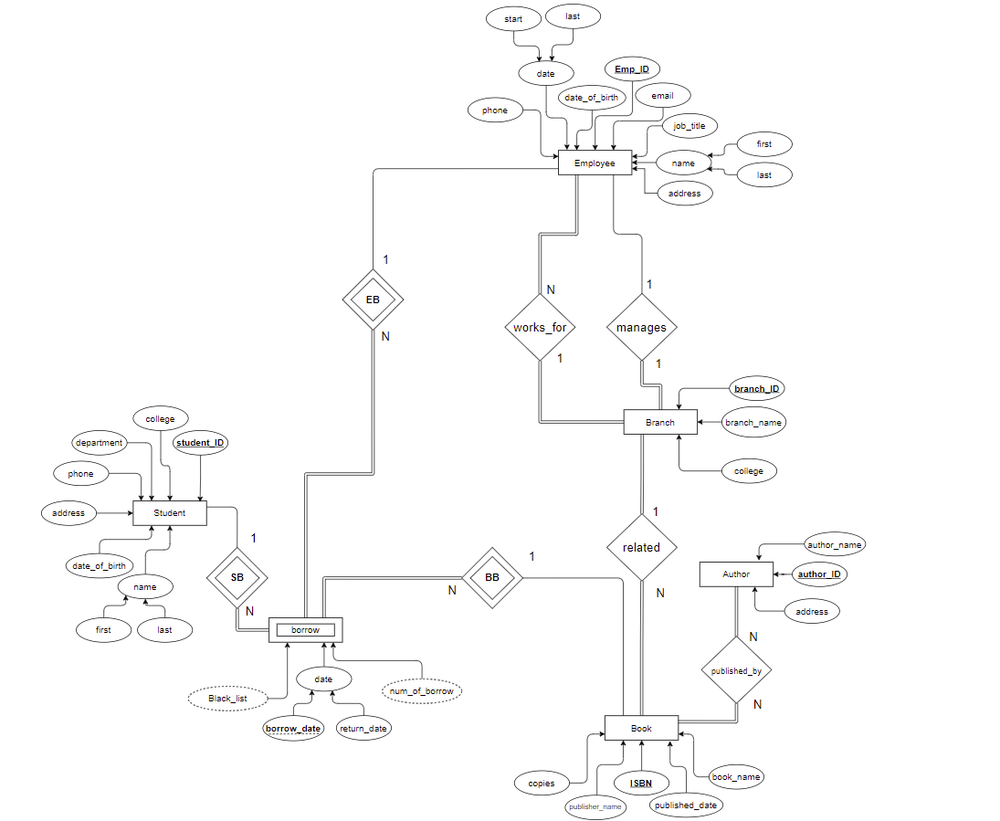
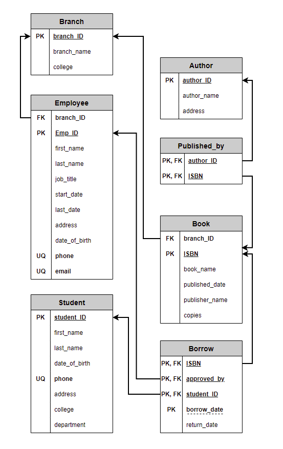
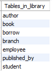

<h1 align="center">Database Library management System</h1>

In this project, you will use a Database Management System to create and manipulate a very small database system for a library

<hr>

### **Data model**

We need to store information about different types of employees (Managers, Workers), Library Branches in different colleges , Students, Books, Publisher (Books details such as ISBN, author, published date, publisher name and address). Borrow information (Books ISBM, students who borrows it, borrow date and due date , an employee who give the books to the borrowers, ... etc). Other requirements are as follows: 

1. An employee can be either a worker or a manager.
2. A library has different branches distributed in colleges (Computer School Library, Eng. School libraries, ... etc). 
3. These branches must have only one manager and can have either one or multiple employees.
4. Each branch contains books related to the school. 
5. Only students can borrow books and the borrow process must be approved by a worker.
6. A student can borrow any books but a book can’t be borrowed if all copies of that book are reserved.
7. A student can perform two actions:
    * Reserve a book and this must include the borrow information such as (ISBN, Borrow date, Due Date, Branch number, the employee who approve it)
    * Return a book and that might include all the information related to the returning  process.
    * Students who did not return books should be listed in the black list and they can not borrow any books within 30 days.


<hr>

### **ER-diagram**



<hr>

### **Relation model**


<hr>
<br>

### **Tables**

* **Author**(**author_ID**, author_name, address)
* **Book**(**ISBN**, book_name, published_date, publisher_name, copies, branch_ID )
* **Borrow**(**ISBN, student_ID, approved_by, borrow_date**, return_date )
* **Branch**(**branch_ID**, branch_name, college)
* **Employee**(**Emp_ID**, first_name, last_name, email, address, job_title, date_of_birth, start_date, last_date, phone, branch_ID  )
* **Student**(**student_ID**, first_name, last_name, date_of_birth, phone, address, college, department)
* **Published_by**(**SBN, author_ID**)

<br>

<hr>
<br>

### **Queries**

<br>

```SQL
use library;
```

<br>

1. Given a student ID, list all the books borrowed by that student.
```SQL
select book_name  as "the books borrowed by 18101" from Book, Student, Borrow 
where ( Book.ISBN = Borrow.ISBN and Borrow.student_ID = Student.student_ID )
and ( Student.student_ID = "18101" ) ;
```
<br>

2. Find the student whose names start with 'J', order by their firstName and lastName
```SQL
select first_name,last_name from Student 
where first_name like "J%"
order by first_name , last_name ;
```

<br>

3. List number of books that are alrady in the system grouped by colleges
```SQL
select college , count(*) as "number of book"
from Book, Branch
where ( Book.branch_ID = Branch.branch_ID )
group by college;
```

<br>

4. Find all books wihch exists in the Computer Science School
```SQL
select book_name as "books in Computer School Library" 
from Book, Branch
where (Book.branch_ID = Branch.branch_ID )
and college = "Computer";
```

<br>

5. List the name and specialty of all the employees who live in Madinah and worked or have been working fro 1 year in this library
```SQL
select  first_name, last_name, job_title, address 
from Employee
where ( address = "Madinah" )
or ((datediff(current_date,start_date) >= 365)
or (datediff(last_date,start_date) >= 365));
```

<br>

6. List the names of students how are currently in the blacklist
```SQL
select Student.student_ID as "Students ID in the blacklist", 
first_name as "First name", last_name as "Last name"
from Student , Borrow
where (Student.student_ID = Borrow.student_ID) 
and return_date = "NOT YET" 
and datediff(current_date,borrow_date) > 30 ;
```

<br>

7. List the books with the maximum number of borrowers
```SQL
select book_name as "Book name" , count(Borrow.student_ID) as "number of borrow"
from Book, Borrow
where Book.ISBN = Borrow.ISBN 
group by Book.ISBN
having count(*) >= all (
select count(*)
from Borrow
group by ISBN
);
```

<br>

8. List the total number of books from each publishers only for those publishers with more than 3 books in the library
```SQL
select  author_name,  count(Author.Author_ID) as "number of book"
from Author, published_by
where Author.author_ID = published_by.author_ID 
group by (Author.author_ID)
having count(Author.Author_ID) > 3;
```

9. Given a ISBN, compute the total number of borrows for the book in this library
```SQL
select book_name , count(*) as "number of borrow"
from Book, Borrow
where Book.ISBN = Borrow.ISBN
and Book.ISBN = 1254789630987;
```


10. List all books which are borrowed in January
```SQL
select book_name from Book, Borrow
where Book.ISBN = Borrow.ISBN
and month(borrow_date) = 1;
```

11. List all books which are returned to the library
```SQL
select book_name 
from book, borrow
where Book.ISBN = borrow.ISBN
and return_date != "NOT YET";
```

12. Find the top 5 borrowed books in the library
```SQL
select book_name, count(*) 
from Book, Borrow
where book.ISBN = Borrow.ISBN
group by book.ISBN
order by count(Book.ISBN) desc limit 5;
```

13. Name of books authored by more than one author
```SQL
select book_name,count(*)
from Book,Author, Published_by
where(( Published_by.author_ID = Author.author_id and Book.ISBN = Published_by.ISBN )
and ( ( author_name = "Steven E."  ) or (author_name = "David M.")) )
group by book_name
having count(*) > 1 ;
```

14. Given the ISBN, the authors of this book
```SQL
select Author.author_name
from Book,Author, Published_by
where(( Published_by.author_ID = Author.author_id and Book.ISBN = Published_by.ISBN )
and ( Book.ISBN = 9780071789714 ) ) ;
```

15. Copies of which are not returned
```SQL
select Book.ISBN, book_name, copies, (copies - count(*)) as "current number of copies"
from Book, Borrow
where (Book.ISBN = Borrow.ISBN) and (return_date = "NOT YET")
group by Book.ISBN ;
```

